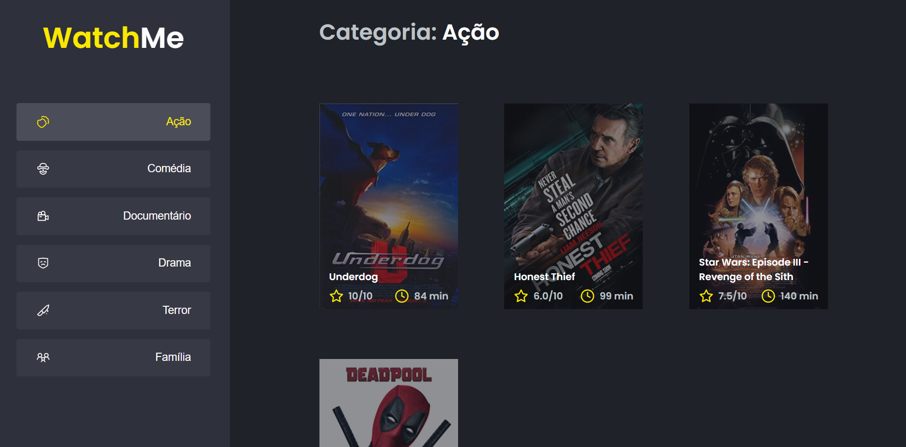

<p align="center">
  

    
 
</p>

<h1 align="center"> 
	 WatchMe - Concluído 🚀
</h1>

<p align="center">
 <a href="#funcionalidades">Funcionalidades</a> •
 <a href="#layout">Layout</a> • 
 <a href="#como-executar-o-projeto">Como executar</a> • 
 <a href="#tecnologias">Tecnologias</a> • 
 <a href="#autor">Autor</a>  
</p>


## 💻 Sobre o projeto

Uma aplicação para listagem de filmes de acordo com gênero consumindo uma api com axios. 

Nesse projeto foi utilizado uma api fake, feito por um arquivo JSON, para poder exibir as informações dos gêneros e filmes.

Projeto desenvolvido durante o Bootcamp Ignite oferecida pela [Rocketseat](https://rocketseat.com.br/).
---

<h2 id="funcionalidades">⚙️ Funcionalidades</h2>

- [x] Listagem de filmes de acordo com o gênero 

---

<h2 id="layout"> 🎨 Layout </h2>

<p align="center" style="display: flex; align-items: flex-start; justify-content: center;">
   
</p>
<a href="https://www.loom.com/share/4a72aba0bd164d30a697671de61f7f80" target="_blank">Link do vídeo da parte web </a>

---

<h2 id="como-executar-o-projeto"> 🚀 Como executar o projeto </h2>

### Pré Requisitos
Antes de começar, você vai precisar ter instalado em sua máquina as seguintes ferramentas:
[Git](https://git-scm.com), [Node.js](https://nodejs.org/en/). 

Além disto é bom ter um editor para trabalhar com o código como [VSCode](https://code.visualstudio.com/) <br/> <br/>
Após ter feito a configuração de instalação na máquina é necessário fazer o download do repostiório [aqui](https://github.com/joseaugustodardengo/Ignite_Componentizando-a-aplicacao/archive/master.zip)
ou realizar o clone do repositório.
```
git clone https://github.com/joseaugustodardengo/Ignite_Componentizando-a-aplicacao
```
Após feito o download, só seguir os passos a seguir no terminal do seu sistema operacional, para conseguir executar os serviços da aplicação.

#### 🧭 Rodando a aplicação

```bash

# Acesse a pasta do projeto no seu terminal/cmd
$ cd Ignite_Componentizando-a-aplicacao

# Instale as dependências com npm ou yarn
$ npm install
$ yarn

# Execute o comando para dar início ao serviço dos dados com npm ou yarn
$ npm run server
$ yarn server

# Em outro terminal, mas no mesmo diretório, execute a aplicação com npm ou yarn
$ npm run dev
$ yarn dev

# A aplicação será aberta na porta:8080 - acesse http://localhost:8080
```
---

<h2 id="tecnologias"> 🛠 Tecnologias </h2>

As seguintes ferramentas foram usadas na construção do projeto:

#### **Website**  ([React](https://reactjs.org/)  +  [TypeScript](https://www.typescriptlang.org/))

-   **[React Icons](https://react-icons.github.io/react-icons/)**
-   **[Axios](https://github.com/axios/axios)**

<h2 id="autor"> Autor </h2>


Feito por **José Augusto Franco Dardengo** <br/>
👋🏽 Entre em contato!

[](https://www.linkedin.com/in/jose-augusto-franco-dardengo/) 
[](mailto:jfrancodardengo@gmail.com)
